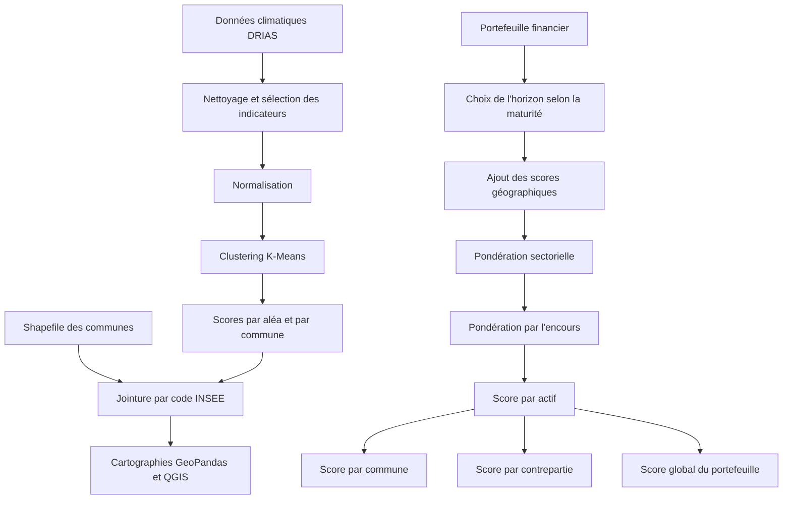

# Finance et risques climatiques : scoring d’un portefeuille d’actifs

<p align="center">
  
</p>


Projet académique réalisé dans le cadre du **Data Challenge Finance et risques climatiques**, organisé par la **Caisse des Dépôts et Consignations**.

L’objectif est de mesurer la vulnérabilité climatique d’un portefeuille fictif d’actifs localisés en France métropolitaine.

Le projet combine :

- collecte et préparation de données climatiques ;
- sélection d’indicateurs d’exposition ;
- normalisation des variables ;
- clustering K-Means ;
- construction de scores climatiques ;
- prise en compte de la maturité des financements ;
- pondération selon le secteur d’activité ;
- agrégation par actif, commune et contrepartie ;
- cartographie avec GeoPandas et QGIS ;
- analyse financière du portefeuille.

> Projet réalisé par Benjamin Baillet, Alexandra Millot et Badr El Habti dans le cadre du Master IREF de l’Université de Bordeaux.

---

## Sommaire

- [Contexte](#contexte)
- [Problématique](#problématique)
- [Objectifs](#objectifs)
- [Portefeuille étudié](#portefeuille-étudié)
- [Sources de données](#sources-de-données)
- [Aléas climatiques](#aléas-climatiques)
- [Horizons temporels](#horizons-temporels)
- [Architecture du projet](#architecture-du-projet)
- [Préparation des données](#préparation-des-données)
- [Construction des scores](#construction-des-scores)
- [Clustering K-Means](#clustering-k-means)
- [Cartographie](#cartographie)
- [Pondération sectorielle](#pondération-sectorielle)
- [Scoring des actifs](#scoring-des-actifs)
- [Agrégation des risques](#agrégation-des-risques)
- [Résultats du portefeuille](#résultats-du-portefeuille)
- [Analyse par aléa](#analyse-par-aléa)
- [Analyse sectorielle](#analyse-sectorielle)
- [Principaux enseignements](#principaux-enseignements)
- [Compétences démontrées](#compétences-démontrées)
- [Limites](#limites)
- [Pistes d’amélioration](#pistes-damélioration)
- [Auteurs](#auteurs)

---

# Contexte

Le changement climatique expose les acteurs économiques et financiers à des risques physiques croissants.

Ces risques peuvent notamment provoquer :

- des dommages aux bâtiments ;
- des interruptions d’activité ;
- une hausse des coûts d’exploitation ;
- une diminution de la valeur des actifs ;
- des difficultés de remboursement ;
- une augmentation du risque financier pour le prêteur.

Pour une institution financière, l’analyse du risque climatique ne peut donc pas se limiter à une lecture géographique.

Elle doit également intégrer :

- la localisation précise de l’actif ;
- l’horizon temporel du financement ;
- le secteur d’activité ;
- le montant de l’encours ;
- la présence éventuelle de plusieurs sites pour une même contrepartie.

---

# Problématique

Le projet répond à la question suivante :

> Comment construire une méthode de scoring permettant de mesurer, comparer et agréger les risques physiques climatiques d’un portefeuille d’actifs financiers ?

La méthodologie doit permettre de produire :

1. un score climatique par commune ;
2. un score pour chaque actif ;
3. un score unique pour chaque contrepartie ;
4. un score agrégé pour l’ensemble du portefeuille ;
5. des restitutions géographiques et financières facilement interprétables.

---

# Objectifs

Le projet poursuit quatre objectifs principaux.

## 1. Sélectionner les aléas

Quatre risques physiques sont étudiés :

- sécheresse ;
- inondations ;
- feux de forêt ;
- vagues de chaleur.

## 2. Choisir les indicateurs

Pour chaque aléa, plusieurs variables climatiques sont sélectionnées afin de représenter :

- son intensité ;
- sa durée ;
- sa fréquence ;
- les conditions favorisant son apparition.

## 3. Construire des scores

Les indicateurs sont normalisés puis regroupés afin de produire un score de risque par commune et par horizon temporel.

## 4. Analyser le portefeuille

Les scores géographiques sont croisés avec :

- la maturité des prêts ;
- le secteur d’activité ;
- la localisation ;
- l’encours financier ;
- l’identifiant de la contrepartie.

---

# Portefeuille étudié

Le portefeuille fictif comprend :

```text
99 actifs
```

Chaque ligne contient les informations suivantes :

| Variable | Description |
|---|---|
| `Identifiant tiers` | Identifiant unique de la contrepartie |
| `Localisation (Commune)` | Commune dans laquelle se situe l’actif |
| `Localisation (Code INSEE)` | Code INSEE utilisé pour les jointures |
| `Secteur d'activité (code NACE 2)` | Secteur économique de l’actif |
| `Maturité du prêt` | Année d’échéance du financement |
| `Encours (million EUR)` | Montant restant dû |
| `Sécheresse` | Score géographique de sécheresse |
| `Inondations` | Score géographique d’inondation |
| `Feux de forêts` | Score géographique de feu de forêt |
| `Vagues de chaleur` | Score géographique de chaleur |

Une contrepartie peut posséder plusieurs actifs et être implantée dans plusieurs communes.

---

# Sources de données

## DRIAS

Les principales données climatiques proviennent de DRIAS, la plateforme française de référence pour les projections climatiques utiles à l’adaptation.

Les fichiers utilisés comprennent notamment :

```text
indices_projets_communes.csv
feux_foret.csv
```

Ils contiennent des données climatiques à l’échelle des communes françaises.

## Données géographiques

Les limites administratives des communes sont utilisées sous forme de Shapefile :

```text
COMMUNE.shp
```

Les géométries permettent :

- de représenter les communes ;
- de joindre les scores climatiques aux codes INSEE ;
- de produire les cartes de risque.

## Portefeuille

Le portefeuille financier est fourni sous forme d’un fichier Excel :

```text
portefeuille_actifs.xlsx
```

## Autres sources prévues par le challenge

Le cahier des charges mentionne également :

- IGN ;
- Géorisques ;
- CORINE Land Cover ;
- QGIS.

Ces sources peuvent compléter les données DRIAS pour affiner l’analyse géographique.

---

# Aléas climatiques

## Sécheresse

Les indicateurs sélectionnés comprennent notamment :

```text
sech
nj_f_chal
```

avec :

- `sech` : durée des épisodes de sécheresse ;
- `nj_f_chal` : nombre de jours de forte chaleur.

La combinaison de ces deux variables permet d’étudier à la fois la durée des périodes sèches et les conditions thermiques qui les aggravent.

---

## Inondations

Les indicateurs comprennent :

```text
prec_cumul
max_jourpluie_cons
sech
```

avec :

- `prec_cumul` : cumul des précipitations ;
- `max_jourpluie_cons` : nombre maximal de jours consécutifs de pluie ;
- `sech` : durée des périodes sèches.

Les précipitations cumulées mesurent la quantité totale d’eau reçue.

La durée des épisodes pluvieux permet de prendre en compte la saturation progressive des sols.

L’indicateur de sécheresse complète l’analyse en représentant les conditions pouvant limiter l’absorption de fortes précipitations.

---

## Feux de forêt

Les variables utilisées comprennent :

```text
nj_f_chal
feu_foret
```

avec :

- `nj_f_chal` : nombre de jours de forte chaleur ;
- `feu_foret` : indicateur lié à la sécheresse de la végétation et aux conditions favorables aux incendies.

La combinaison permet de mesurer :

- les conditions climatiques propices au départ de feu ;
- l’état de sécheresse de la végétation ;
- la gravité potentielle du phénomène.

---

## Vagues de chaleur

Les indicateurs retenus sont :

```text
temp_max
nj_vdc
```

avec :

- `temp_max` : température maximale ;
- `nj_vdc` : nombre de jours appartenant à une vague de chaleur.

La température représente l’intensité du phénomène.

Le nombre de jours permet d’en mesurer la durée.

---

# Horizons temporels

Trois horizons climatiques sont analysés :

| Horizon | Période |
|---|---|
| H1 | 2021-2050 |
| H2 | 2051-2070 |
| H3 | 2071-2100 |

La maturité de chaque prêt détermine l’horizon climatique utilisé.

```python
maturites_portefeuille = Portefeuille[
    "Maturité du prêt"
].apply(
    lambda x:
        "H1" if 2021 <= x <= 2050
        else "H2" if 2051 <= x <= 2070
        else "H3"
)
```

Cette étape permet d’adapter le niveau de risque à la durée réelle d’exposition du financement.

---

# Architecture du projet



---

# Préparation des données

## Chargement

Les données DRIAS sont chargées avec Pandas :

```python
df_drias = pd.read_csv(
    "../donnees/drias/indices_projets_communes.csv",
    encoding="utf-8"
)
```

Le portefeuille est chargé avec :

```python
Portefeuille = pd.read_excel(
    "../donnees/portefeuille_actifs.xlsx"
)
```

## Contrôles

Les contrôles portent notamment sur :

- les valeurs manquantes ;
- les doublons ;
- les types de données ;
- les codes INSEE ;
- les périodes climatiques ;
- les colonnes inutiles.

## Sélection des colonnes

Les colonnes climatiques principales sont renommées pour faciliter leur utilisation :

```python
df_drias.columns = [
    "nom",
    "insee",
    "periode",
    "temp_max",
    "nj_f_chal",
    "nj_vdc",
    "prec_cumul",
    "max_jourpluie_cons",
    "sech",
    "temps_sech"
]
```

---

# Construction des scores

Les variables associées à chaque aléa ne possèdent pas nécessairement les mêmes unités.

Par exemple :

- température en degrés ;
- durée en jours ;
- précipitations en millimètres ;
- indicateurs normalisés.

Une standardisation est donc appliquée :

```python
scaler = StandardScaler()
variables_standardisees = scaler.fit_transform(
    variables_climatiques
)
```

Cette transformation centre et réduit les variables afin d’éviter qu’un indicateur doté d’une grande échelle numérique domine artificiellement le clustering.

---

# Clustering K-Means

## Principe

K-Means sépare les observations en groupes homogènes.

L’algorithme cherche à :

- minimiser la variance à l’intérieur des clusters ;
- maximiser la séparation entre les clusters ;
- identifier automatiquement les niveaux de risque présents dans les données.

## Méthode du coude

Le nombre de clusters est choisi en observant l’évolution de l’inertie pour différentes valeurs de `k`.

```python
inerties = []

for k in range(1, 11):
    modele = KMeans(
        n_clusters=k,
        random_state=333
    )

    modele.fit(variables_standardisees)
    inerties.append(modele.inertia_)
```

Le point à partir duquel l’amélioration de l’inertie devient moins importante correspond au nombre de groupes retenu.

## Classement des clusters

Les numéros générés par K-Means sont arbitraires.

Les clusters sont donc réordonnés selon le niveau moyen des indicateurs :

```text
0 = risque faible
1 = risque modéré
2 = risque élevé
3 = risque critique
```

Les échelles utilisées sont :

| Aléa | Échelle |
|---|---|
| Sécheresse | 0 à 2 |
| Inondations | 0 à 3 |
| Feux de forêt | 0 à 3 |
| Vagues de chaleur | 0 à 2 |

---

# Cartographie

## GeoPandas

GeoPandas permet de produire automatiquement des cartes pour chacun des horizons :

```text
H1
H2
H3
```

Le Shapefile des communes est chargé avec :

```python
commune_map = gpd.read_file(
    "../donnees/geographie/COMMUNE.shp"
)
```

La jointure repose sur :

```text
insee ↔ INSEE_COM
```

## QGIS

QGIS est utilisé pour créer des cartes plus détaillées sur l’ensemble de la période étudiée.

La méthodologie comprend :

1. chargement du fichier CSV ;
2. chargement du Shapefile ;
3. jointure entre les codes INSEE ;
4. choix d’une symbologie catégorisée ;
5. attribution d’une couleur à chaque score ;
6. ajout du titre, de la légende et de l’échelle.

---

# Résultats géographiques

## Feux de forêt

Les cartes montrent une aggravation progressive du risque.

Les zones les plus exposées se concentrent particulièrement :

- dans le sud ;
- dans le sud-est ;
- dans la région méditerranéenne ;
- en Corse.

## Vagues de chaleur

Le risque augmente sur l’ensemble du territoire au fil des horizons.

Les risques élevés deviennent particulièrement visibles :

- dans le sud ;
- dans le centre ;
- progressivement dans une grande partie du pays.

## Sécheresse

Les cartes mettent en évidence une extension des zones à risque élevé, notamment :

- dans le sud ;
- dans le centre ;
- dans certaines régions de l’est.

## Inondations

Les risques restent fortement liés aux zones historiquement vulnérables.

L’évolution met notamment en évidence :

- le sud-est ;
- le sud-ouest ;
- certaines zones proches de grands cours d’eau.

---

# Pondération sectorielle

La vulnérabilité d’un actif ne dépend pas uniquement de sa localisation.

Un même aléa peut avoir des impacts très différents selon l’activité économique.

Une pondération sectorielle est donc attribuée à chaque combinaison :

```text
secteur × aléa
```

L’échelle utilisée est :

```text
0 = impact nul ou négligeable
1 = exposition modérée
2 = forte exposition
```

Exemple :

```python
risque_secteur = {
    36: {
        "Sécheresse": 2,
        "Inondations": 2,
        "Feux de forêts": 0,
        "Vagues de chaleur": 1
    },

    41: {
        "Sécheresse": 0,
        "Inondations": 2,
        "Feux de forêts": 0,
        "Vagues de chaleur": 2
    },

    86: {
        "Sécheresse": 1,
        "Inondations": 2,
        "Feux de forêts": 0,
        "Vagues de chaleur": 2
    }
}
```

---

# Exemples de pondérations

## Eau — NACE 36

- sécheresse : 2 ;
- inondations : 2 ;
- feux de forêt : 0 ;
- vagues de chaleur : 1.

La disponibilité et le traitement de l’eau sont directement affectés par les sécheresses et les inondations.

## Construction — NACE 41

- sécheresse : 0 ;
- inondations : 2 ;
- feux de forêt : 0 ;
- vagues de chaleur : 2.

Les inondations peuvent endommager les chantiers et les vagues de chaleur détériorer les conditions de travail.

## Activités hospitalières — NACE 86

- sécheresse : 1 ;
- inondations : 2 ;
- feux de forêt : 0 ;
- vagues de chaleur : 2.

Les établissements hospitaliers sont sensibles à la continuité des services, à la chaleur et aux dommages causés aux infrastructures.

---

# Scoring des actifs

Pour chaque actif, les quatre scores géographiques sont récupérés selon :

- le code INSEE ;
- la maturité du prêt ;
- l’horizon correspondant.

Le score climatique brut est :

```math
Score_{brut}
=
\sum_{r}
Poids_{secteur,r}
\times
Score_{géographique,r}
```

Le score pondéré de l’actif est ensuite :

```math
Score_{actif}
=
Score_{brut}
\times
\frac{Encours_{actif}}{Encours_{portefeuille}}
```

Cette pondération donne davantage d’importance aux actifs représentant les encours financiers les plus élevés.

---

# Score maximal

Un score maximal théorique est calculé pour chaque actif.

Les valeurs maximales sont :

```text
Sécheresse : 2
Inondations : 3
Feux de forêt : 3
Vagues de chaleur : 2
```

Le ratio d’un actif est alors :

```math
Ratio_{actif}
=
\frac{Score_{actif}}
{Score_{maximum,actif}}
```

Ce ratio permet de comparer des actifs issus de secteurs différents malgré des scores maximums distincts.

---

# Agrégation des risques

## Par commune

Les scores des actifs d’une même commune sont additionnés :

```math
Score_{commune}
=
\sum Score_{actif}
```

Le ratio communal est :

```math
Ratio_{commune}
=
\frac{Score_{total,commune}}
{Score_{maximum,commune}}
```

Le score total mesure la concentration absolue des risques.

Le ratio mesure l’intensité relative de l’exposition.

## Par contrepartie

Une même contrepartie peut posséder plusieurs actifs et plusieurs implantations.

Son score est donc :

```math
Score_{contrepartie}
=
\sum Score_{actif}
```

Le ratio est calculé par rapport à son score maximal théorique.

## Au niveau du portefeuille

Le score global est la somme des scores pondérés de tous les actifs :

```math
Score_{portefeuille}
=
\sum Score_{actif}
```

---

# Résultats du portefeuille

## Score global

| Indicateur | Valeur |
|---|---:|
| Score global du portefeuille | **6,50471** |
| Score global maximal | **10,9908** |

Le portefeuille possède donc une exposition climatique notable, mais inférieure au maximum théorique déterminé par la méthode.

---

# Analyse par aléa

Les contributions moyennes obtenues sont :

| Aléa | Contribution moyenne |
|---|---:|
| Inondations | **1,76768** |
| Vagues de chaleur | **1,24242** |
| Sécheresse | **0,79798** |
| Feux de forêt | **0,55556** |

## Risque dominant

Les inondations représentent la contribution moyenne la plus élevée.

Elles constituent donc le risque climatique prioritaire dans le portefeuille étudié.

## Risques intermédiaires

Les vagues de chaleur et la sécheresse occupent une position intermédiaire.

Leur influence est importante, mais inférieure à celle des inondations.

## Risque plus localisé

Les feux de forêt présentent la contribution moyenne la plus faible.

Cela ne signifie pas qu’ils sont négligeables : leur impact est davantage concentré sur certaines zones géographiques.

---

# Analyse sectorielle

## Secteurs présentant des ratios élevés

Les secteurs les plus exposés comprennent notamment :

```text
36 — Captage, traitement et distribution d’eau
41 — Construction de bâtiments
86 — Activités hospitalières
```

Ces activités peuvent être fortement affectées par :

- les dommages aux infrastructures ;
- les interruptions d’activité ;
- la disponibilité de l’eau ;
- les vagues de chaleur ;
- la concentration géographique des actifs.

## Secteurs présentant des ratios intermédiaires

Les secteurs présentant des niveaux intermédiaires comprennent notamment :

```text
70 — Activités des sièges sociaux
85 — Enseignement
88 — Action sociale sans hébergement
```

## Secteurs présentant des ratios plus faibles

Les secteurs les moins exposés dans la méthodologie comprennent notamment :

```text
79 — Activités des agences de voyage
94 — Activités des organisations associatives
```

Ces résultats dépendent cependant des pondérations retenues et de la localisation réelle des actifs.

---

# Principaux enseignements

## 1. Les risques augmentent avec le temps

Les projections montrent une aggravation progressive des risques, notamment pour :

- les vagues de chaleur ;
- les sécheresses ;
- les feux de forêt.

## 2. Le risque est spatialement concentré

Le sud et le sud-est sont particulièrement exposés à plusieurs aléas.

## 3. Les inondations dominent le portefeuille

Elles représentent la contribution moyenne la plus importante.

## 4. Le secteur modifie fortement l’exposition

Une localisation donnée ne produit pas le même risque financier selon l’activité exercée.

## 5. L’encours doit être intégré

Un actif très exposé mais peu financé n’a pas le même impact sur le portefeuille qu’un actif doté d’un encours élevé.

## 6. Le ratio complète le score absolu

Le score total identifie les concentrations financières.

Le ratio met en évidence les actifs ou communes proportionnellement les plus exposés.

---

# Compétences démontrées

## Data Analysis

- nettoyage de données ;
- contrôle de qualité ;
- sélection de variables ;
- analyse de corrélations ;
- segmentation ;
- agrégation.

## Python

- Pandas ;
- NumPy ;
- fonctions ;
- dictionnaires ;
- boucles ;
- groupby ;
- merge ;
- exports Excel.

## Machine Learning non supervisé

- standardisation ;
- K-Means ;
- méthode du coude ;
- interprétation des centroïdes ;
- réorganisation des clusters.

## Analyse géospatiale

- GeoPandas ;
- Shapefiles ;
- codes INSEE ;
- jointures géographiques ;
- cartes choroplèthes ;
- QGIS.

## Finance et gestion des risques

- scoring climatique ;
- pondération par l’encours ;
- agrégation de portefeuille ;
- analyse par secteur ;
- analyse par contrepartie ;
- horizon de financement.

## Communication

- présentation de résultats ;
- cartographie ;
- restitution visuelle ;
- documentation méthodologique ;
- synthèse destinée à des décideurs.

---

# Limites

- Le portefeuille est fictif.
- Le nombre d’actifs est limité à 99.
- Les scores dépendent des indicateurs sélectionnés.
- Les pondérations sectorielles reposent sur une approche experte.
- K-Means est sensible à la standardisation et aux valeurs extrêmes.
- Le nombre de clusters dépend de l’interprétation de la méthode du coude.
- Les clusters ne correspondent pas directement à des probabilités de sinistre.
- Les aléas sont étudiés séparément avant leur agrégation.
- Les interactions entre les risques ne sont pas modélisées.
- Les capacités d’adaptation propres aux actifs ne sont pas intégrées.
- La vulnérabilité des bâtiments n’est pas décrite individuellement.
- Le risque de transition n’est pas étudié.
- Le risque côtier bonus n’est pas intégré au score final.
- Les résultats ne constituent pas une évaluation réglementaire ou prudentielle.

---

# Pistes d’amélioration

- intégrer Géorisques pour les inondations actuelles ;
- intégrer CORINE Land Cover pour le couvert forestier ;
- intégrer les risques côtiers ;
- ajouter l’érosion et la submersion marine ;
- modéliser les interactions entre les aléas ;
- ajouter des indicateurs de vulnérabilité des bâtiments ;
- intégrer des mesures d’adaptation ;
- comparer K-Means avec une classification par quantiles ;
- tester DBSCAN ou un clustering hiérarchique ;
- réaliser une analyse de sensibilité des pondérations ;
- produire des intervalles d’incertitude ;
- ajouter plusieurs scénarios climatiques ;
- construire un tableau de bord Power BI ;
- automatiser la mise à jour des données ;
- produire un reporting par contrepartie ;
- développer une application Streamlit ;
- créer une API de scoring climatique.

---

# Conclusion

Le projet construit une chaîne complète d’analyse du risque climatique :

```text
Données climatiques
        ↓
Sélection des indicateurs
        ↓
Normalisation
        ↓
Clustering
        ↓
Scores géographiques
        ↓
Pondération sectorielle
        ↓
Pondération par l’encours
        ↓
Scores par actif
        ↓
Agrégation par commune et contrepartie
        ↓
Score global du portefeuille
```

Les résultats montrent que :

- les risques physiques augmentent sur les horizons futurs ;
- les inondations représentent le risque moyen dominant ;
- les vagues de chaleur et la sécheresse constituent des risques importants ;
- les feux de forêt sont davantage localisés ;
- certains secteurs sont nettement plus vulnérables ;
- la combinaison de la géographie, du secteur, de la maturité et de l’encours est indispensable pour obtenir une lecture financière pertinente.

La méthodologie fournit ainsi un cadre reproductible permettant d’intégrer les risques physiques climatiques dans l’analyse d’un portefeuille financier.

---

# Auteurs

Projet réalisé par :

- Benjamin Baillet ;
- Alexandra Millot ;
- Badr El Habti.

Établissement :

```text
Université de Bordeaux
Master IREF
```

## Benjamin Baillet

Compétences principales :

- Python ;
- Pandas ;
- analyse de données ;
- analyse géospatiale ;
- QGIS ;
- gestion des risques ;
- finance climatique ;
- SQL ;
- Power BI ;
- R.
